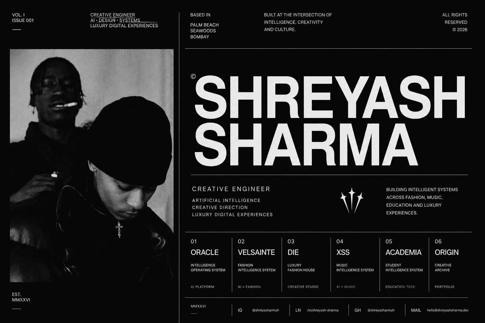

<p align="center">
  
</p>

<br>

<div align="center">

# SHREYASH SHARMA

### Creative Engineer

**Artificial Intelligence · Creative Direction · Luxury Digital Experiences**

*Building intelligent systems where engineering meets editorial precision.*

<br>

<a href="https://github.com/shreyasharmuh">

</a>

&nbsp;&nbsp;&nbsp;

<a href="https://www.linkedin.com/in/shreyash-sharma-562a333a5/">

</a>

&nbsp;&nbsp;&nbsp;

<a href="https://www.instagram.com/shreyasharmuh/">

</a>

&nbsp;&nbsp;&nbsp;

<a href="mailto:deadpoison75@gmail.com">

</a>

</div>

---

# MANIFESTO

I build intelligent products where engineering, artificial intelligence, and editorial thinking converge.

My work focuses on creating timeless digital experiences that combine technical excellence with luxury aesthetics, precision, and meaningful design.

Every product is built as a complete system—not simply as software.

---

# CURRENT ECOSYSTEM

| SYSTEM | DESCRIPTION |
|:-------|:------------|
| **ORACLE** | Intelligence Operating System |
| **VELSAINTE** | Fashion Intelligence System |
| **DIE** | Luxury Fashion House · Creative Studio |
| **XSS** | Music Intelligence System |
| **ACADEMIA** | Student Intelligence System |
| **ORIGIN** | Personal Portfolio & Creative Archive |

---

# CURRENT PRACTICE

```text
Artificial Intelligence

Machine Learning

Deep Learning

Large Language Models

Computer Vision

Python

TypeScript

Next.js

React

PostgreSQL

Creative Direction

Luxury Brand Systems
```

---

# DESIGN PRINCIPLES

> Engineering is design.

> Systems over trends.

> Typography before decoration.

> Precision is luxury.

> Simplicity is sophistication.

---

# CURRENT FOCUS

### BUILDING

- ORACLE
- VELSAINTE
- DIE

### LEARNING

- AI Engineering
- Deep Learning
- Computer Vision
- Multimodal AI

### EXPLORING

- Fashion Intelligence
- Editorial Systems
- Luxury Strategy
- Human-Centered AI

---

# FEATURED REPOSITORIES

| PROJECT | CATEGORY |
|:---------|:---------|
| **ORACLE** | Artificial Intelligence |
| **VELSAINTE** | Fashion Intelligence |
| **DIE** | Luxury Brand |
| **XSS** | Music Intelligence |
| **ACADEMIA** | Education Technology |
| **ORIGIN** | Portfolio |

---

# GITHUB ANALYTICS

<p align="center">


</p>

---

# DIRECTORY

| PLATFORM | LINK |
|:----------|:-----|
| GitHub | https://github.com/shreyasharmuh |
| LinkedIn | https://www.linkedin.com/in/shreyash-sharma-562a333a5/ |
| Instagram | https://www.instagram.com/shreyasharmuh/ |
| Portfolio | Coming Soon |
| Email | deadpoison75@gmail.com |

---

<div align="center">

### PALM BEACH · SEAWOODS · NAVI MUMBAI

MMXXVI

Designed & Engineered by

# SHREYASH SHARMA

</div>